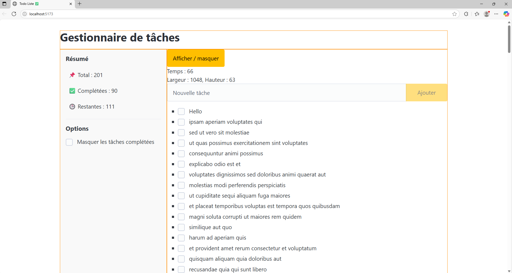
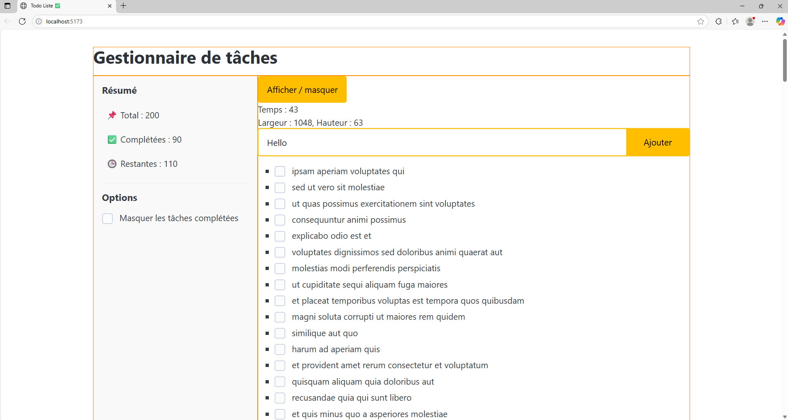
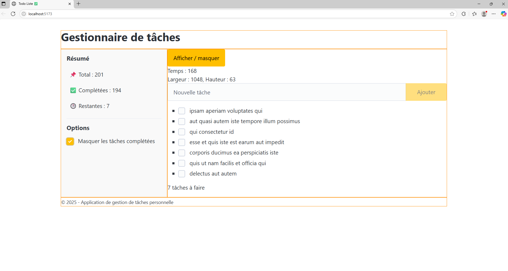
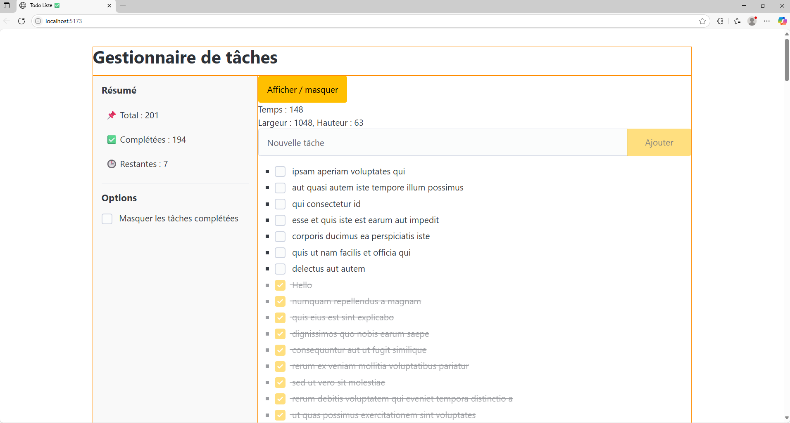

# ✅ TodoListe

Une application de gestion de tâches réalisée avec **Vue 3**, **Vite** et des composants personnalisés. Elle permet d’ajouter, trier, filtrer et suivre le temps passé dans l’interface grâce à un timer intégré.

---

## ➤ Table des matières

- [➤ Technologies utilisées]()
- [➤ Installation]()
- [➤ Démarrage du projet]()
- [➤ Fonctionnalités]()
- [➤ Détails des composants]()
- [➤ Interface & Design]()
- [➤ License]()
- [➤ Aperçu]()
- [➤ Contact]()

---

## ✨ Fonctionnalités

- ✅ Ajouter une nouvelle tâche
- ✅ Marquer une tâche comme complétée (via un composant `Checkbox`)
- ✅ Trier automatiquement les tâches : non complétées en premier
- ✅ Masquer les tâches complétées (option utilisateur)
- ✅ Affichage dynamique : message si aucune tâche n’est présente
- ✅ Suivi du temps via un composant `Timer`
- ✅ Interface en sections : Header, Aside (stats/options), Main (formulaire et liste), Footer
- ✅ Composants réutilisables (`Checkbox`, `Button`, `Layout`, `Timer`)

---

## 🛠️ Stack technique

- ⚙️ [Vue 3](https://vuejs.org/) (Composition API + `<script setup>`)
- ⚡ [Vite](https://vitejs.dev/) pour un développement ultra-rapide
- 🎨 CSS custom minimaliste (style intégré au composant)
- 📦 API externe simulée : [JSONPlaceholder](https://jsonplaceholder.typicode.com/)

---

## 📦 Installation

1. Clone le dépôt :

```bash
git clone https://github.com/amandinekemp/todolist.git
cd todolist
```

2. Installe les dépendances :

```bash
npm install
```

---

## 🚀 Démarrage du projet

### En développement

```bash
npm run dev
```

Visite ensuite : [http://localhost:5173](http://localhost:5173)

### Build de production

```bash
npm run build
```

### Prévisualisation du build

```bash
npm run preview
```

---

## 🔍 Détails des composants

### `App.vue`

* Gère l’état global : `tasks`, `newTask`, `hideCompleted`, `showTimer`
* Utilise `fetch()` pour charger des tâches fictives au montage
* Calcule dynamiquement :

    * `sortedTasks` : tri par état de complétion
    * `remainingTasks` : nombre de tâches non complétées
* Affiche un formulaire, la liste triée et un résumé latéral

### `Checkbox.vue`

* Composant réutilisable avec `v-model`
* Émet des événements `check` / `uncheck` personnalisés

### `Layout.vue`

* Structure en grille : `header`, `aside`, `main`, `footer`
* Slots pour une organisation claire

### `Timer.vue`

* Timer auto-incrémenté (en secondes)
* Affiche les dimensions du bloc au montage

---

## 🎨 Interface & Design

L’interface est sobre et structurée :

* Mise en page responsive via `grid-template-columns`
* Styles internes pour les éléments : `aside`, `completed`, etc.
* Icônes et emojis pour lisibilité rapide

## 📄 Licence

Projet open-source sous licence [MIT](LICENSE).

---

## 🖼️ Aperçu






---

## ➤ Contact

* Amandine Kemp

    - [Github](https://github.com/amandinekemp)
    - [LinkedIn](https://www.linkedin.com/in/amandinekemp/)
