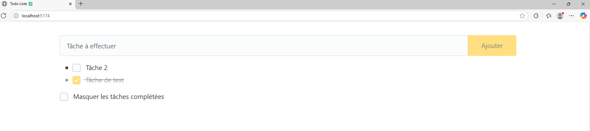
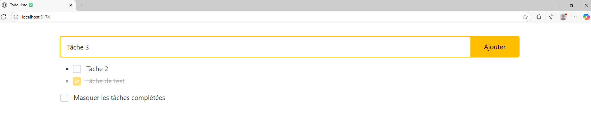
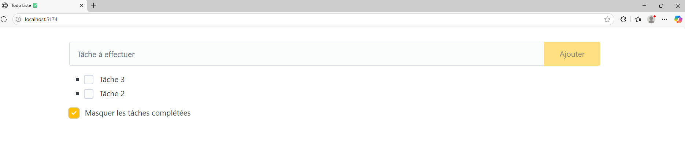
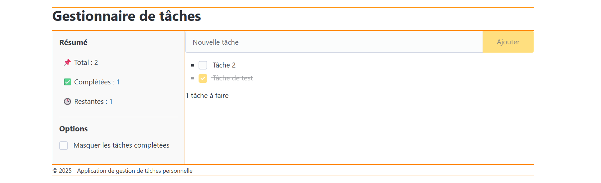

# ✅ TodoListe

Une application de liste de tâches simple et moderne réalisée avec **Vue 3**, **Vite** et le framework CSS minimaliste **Pico.css**.
Elle permet d’ajouter, trier et filtrer des tâches en fonction de leur état (complétée ou non).

---

## ✨ Fonctionnalités

* ✅ Ajouter une tâche
* ✅ Marquer une tâche comme complétée
* ✅ Trier les tâches (non complétées en premier)
* ✅ Masquer les tâches complétées
* ✅ Affichage conditionnel si la liste est vide
* ✅ Interface responsive grâce à Pico.css

---

## 🛠️ Stack technique

* **Vue 3** (Composition API)
* **Vite** pour le bundling rapide
* **Pico.css** pour le design
* **JavaScript** natif

---

## 📦 Installation

1. **Clone le dépôt** :

   ```bash
   git clone https://github.com/amandinekemp/todolist.git
   cd todolist
   ```

2. **Installe les dépendances** :

   ```bash
   npm install
   ```

---

## 🚀 Démarrage du projet

### En mode développement :

```bash
npm run dev
```

Accède ensuite à [http://localhost:5173](http://localhost:5173)

### Pour créer une version de production :

```bash
npm run build
```

### Pour prévisualiser le build :

```bash
npm run preview
```

---

## 🔍 Code principal

### `AppTodolist.vue`

* Utilise `v-model` pour la liaison bidirectionnelle des champs.
* Trie les tâches avec une méthode `sortedTasks()`.
* Applique un style `.completed` pour les tâches faites.
* Masque les tâches complétées si la case est cochée.

### `main.js`

* Monte l'application Vue dans l'élément `#app`.

---

## 🎨 Design

L'interface utilise [Pico.css Amber Theme](https://picocss.com/docs/themes.html#amber) pour un design élégant et minimaliste sans effort.

---

## 🖼️ Aperçu






---

## ➤ Contact

* Amandine Kemp

    - [Github](https://github.com/amandinekemp)
    - [LinkedIn](https://www.linkedin.com/in/amandinekemp/)
